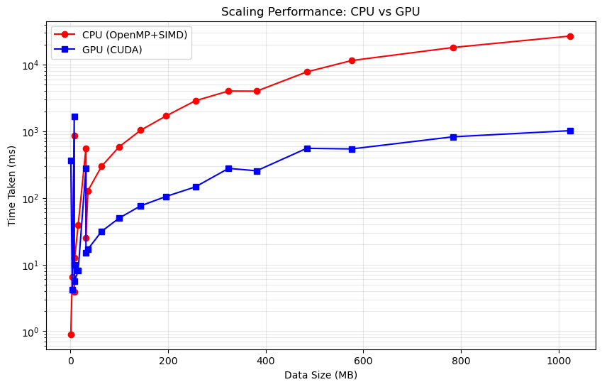

# GPU-Accelerated Symmetric Matrix Multiplication ($A \times A^T$)

This project explores **High-Performance Computing (HPC)** optimizations for computing the product of a matrix and its transpose ($A \times A^T$). It features a side-by-side comparison of three distinct implementations, scaling from a baseline serial approach to a massively parallel CUDA implementation.


## Project Goals
The primary objective was to minimize execution time by leveraging hardware-specific features:
* **Exploiting Symmetry:** Only the lower triangular part of the result matrix is computed, reducing the total workload by approximately 50%.
* **Memory Locality:** Implementing tiling strategies to maximize cache reuse.
* **Architecture Utilization:** Squeezing maximum GFLOPS out of both multi-core CPUs (SIMD) and NVIDIA GPUs (CUDA).

---

## Tech Stack & Optimizations

### 1. Reference Implementation (CPU)
* **Approach:** Standard triple-nested loop.
* **Purpose:** Serves as the "Gold Standard" for correctness verification.

### 2. Optimized CPU (OpenMP + AVX2)
* **Vectorization:** Uses AVX2 intrinsics and `float8_t` vector types to process 8 floats per instruction.
* **Parallelism:** Multi-threaded execution via **OpenMP** to saturate all available CPU cores.
* **Alignment:** Aligned memory allocation (64-byte) to prevent performance penalties on SIMD loads.

### 3. Optimized GPU (CUDA)
* **Register Tiling:** Implements an $8 \times 8$ micro-kernel to minimize global memory traffic by keeping data in high-speed registers.
* **Memory Coalescing:** Optimized thread-mapping to ensure high-bandwidth memory access.
* **Preprocessing:** Includes a custom transpose and padding kernel to prepare data for optimal GPU throughput.


---

### Benchmarking Environment
* **CPU:** AMD Ryzen 5 5600X (Zen 3 Architecture)
* **GPU:** NVIDIA GeForce RTX 5070 (Blackwell Architecture)
* **Compiler:** GCC 11.4.0 (with OpenMP 4.5 support)
* **CUDA Toolkit:** v13.0
* **Vectorization:** AVX2, FMA (256-bit SIMD)

## Performance Benchmarks

The following chart illustrates the execution time scaling as the matrix size increases. Note the log-log scale, which highlights the massive throughput gap as the workload exceeds 100MB of data.

<p align="center">
  
</p>

### Key Takeaway
While the CPU wins on "thin" matrices due to lower launch overhead, the CUDA implementation scales significantly better once the GPU occupancy is saturated, hitting a peak of **4.1 TFLOPS**.


---

## Getting Started

### Prerequisites
* **OS:** Ubuntu 22.04 LTS or newer
* **Compiler:** `g++` (v9+) and `nvcc` (CUDA 11+)
* **Hardware:** NVIDIA GPU (Compute Capability 7.0+)

### Installation & Execution
1. **Clone the repository:**
   ```bash
   git clone https://github.com/peloe1/matmul.git
   cd matmul
   
2. **Compile the project:**
   ```bash
   # Compile CPU implementation
   g++ -O3 -fopenmp -mavx2 -c matmul.cc -o cpu.o
   # Compile GPU implementation
   nvcc -O3 -c matmul.cu -o gpu.o
   # Link everything with the main driver
   nvcc -O3 main.cc cpu.o gpu.o -lgomp -o benchmark
   
4. **Run the suite:**
   ```bash
   ./benchmark

